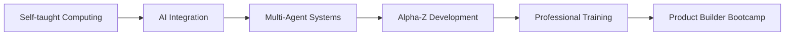

# 👋 Hi there, I'm Matthieu | Salut, je suis Matthieu

[](https://git.io/typing-svg)

## 🚀 About Me | À propos

**🇬🇧 English:**
Self-taught developer passionate about AI and accessibility, currently developing Alpha-Z Core - an augmented intelligence ecosystem designed for neurodivergent profiles and people with reduced mobility. I combine rapid learning skills with an innovative vision to create personalized cognitive assistance solutions.

**🇫🇷 Français:**
Développeur autodidacte passionné d'IA et d'accessibilité, je développe actuellement Alpha-Z Core - un écosystème d'intelligence augmentée conçu pour les profils neurodivergents et personnes à mobilité réduite. Je combine une capacité d'apprentissage rapide avec une vision innovante pour créer des solutions d'assistance cognitive personnalisées.

---

## 🎯 Current Focus | Focus Actuel

### 🧠 **Alpha-Z Core Ecosystem**
> *Revolutionary AI-powered cognitive assistance platform*

**Architecture Components:**
- 🧠 **Alpha-Z Primordial**: Central consciousness with 120+ neural agents
- 🧾 **DocFlow-Z**: Intelligent document processing (12 specialized agents)
- 📊 **Matrix-Z**: Data organization & access
- 🔄 **Context-Z**: Conversational context management  
- ⏰ **Chrono-Z**: Adaptive temporal management
- 📱 **Synaps-Z**: Neuroadaptive mobile interface *(École 42 project)*

**Tech Stack:**
- 🐍 Python + FastAPI microservices
- 🥧 Raspberry Pi + Cloud deployment
- 🤖 Multi-engine OCR (Tesseract, PaddleOCR)
- 🐧 Redis Streams + PostgreSQL + MinIO
- ⚛️ React + TypeScript (PWA)
- 🧠 Biomimetic agent surveillance hierarchy

---

## 📊 GitHub Stats | Statistiques

<div align="center">


</div>

---

## 🛠️ Technical Skills | Compétences Techniques

### 💻 **Programming & Development**


### 🤖 **AI & Automation**


### 🔧 **Systems & Tools**


### 🎯 **Expertise Areas**
```
🧠 Biomimetic Neural Architecture   ████████████████████ 100%
🏗️ Multi-Agent Systems            ████████████████████ 100%  
🤖 AI API Integration             ████████████████░░░░  80%
🐍 Python + FastAPI Development  ████████████░░░░░░░░  60%
🔧 System Administration         ████████████░░░░░░░░  60%
📱 Modern UI/UX (React/TS)       ██████████░░░░░░░░░░  50%
```

---

## 🎯 Featured Projects | Projets Phares

### 🌟 **Alpha-Z Core Ecosystem** *(Active Development)*
```yaml
Description: Complete artificial brain with 120+ neural agents
Status: Multi-project ecosystem (Advanced Phase)
Architecture: Neuronal hierarchy with consciousness simulation
Components: DocFlow-Z, Chrono-Z, Matrix-Z, Context-Z
Deployment: Raspberry Pi + Cloud-native microservices
Innovation: Biomimetic neural surveillance system
```

### 🏗️ **DocFlow-Z** *(Production Ready)*
```yaml
Description: Intelligent document processing with agent architecture  
Status: Complete refactor - V2.0 ready for École 42
Architecture: 12 specialized agents (Receipt, Invoice, Contract)
Tech Stack: FastAPI + Redis + PostgreSQL + React
Innovation: "One Agent = One Responsibility" principle
Market: B2B SaaS - 2.3M French SMEs target
```

### 🛠️ **Automated Software Installation** *(Professional)*
```yaml
Description: Compliance software auto-installer for IT company
Context: Internship project at CRIC Pau
Technology: Process automation
Impact: Streamlined client onboarding
```

---

## 📈 Development Journey | Parcours de Développement

### 🎯 **2025 Milestones**
- ✅ Alpha-Z neuronal architecture (120+ agents)
- ✅ DocFlow-Z V2.0 complete refactor
- ✅ Multi-agent communication system
- ✅ Biomimetic surveillance hierarchy
- 🔄 École 42 presentation (BTP + Family specializations)
- 📅 Production deployment & SME pilot testing *(Q4 2025)*

### 🚀 **Learning Path**


---

## 🌍 Vision & Mission | Vision et Mission

### 🎯 **Mission**
Creating accessible AI solutions that adapt to individual cognitive needs, particularly for neurodivergent profiles and people with reduced mobility.

### 🚀 **Vision** 
Building an AI ecosystem where technology truly serves human diversity, enabling everyone to reach their full potential through personalized cognitive assistance.

---

## 📫 Connect With Me | Me Contacter

<div align="center">

[](mailto:alphazprimordial@gmail.com)
[](https://github.com/AlphaZ42)
[](https://maps.google.com)

</div>

---

## 💡 Current Status | Statut Actuel

```python
class Developer:
    def __init__(self):
        self.name = "Matthieu HUFFSCHMITT"
        self.role = "AI Developer in Career Transition"
        self.location = "Sud Landes, France"
        self.current_focus = ["Alpha-Z Core", "AI Integration", "Accessibility"]
        self.learning = ["No-Code Development", "Product Management"]
        self.looking_for = ["Collaboration", "Feedback", "Innovation Partners"]
    
    def say_hi(self):
        print("Thanks for visiting my profile! Let's build the future of AI together! 🚀")

me = Developer()
me.say_hi()
```

---

<div align="center">

### 🌟 "Technology should adapt to humans, not the other way around" 🌟

[](https://github.com/AlphaZ42)

</div>
